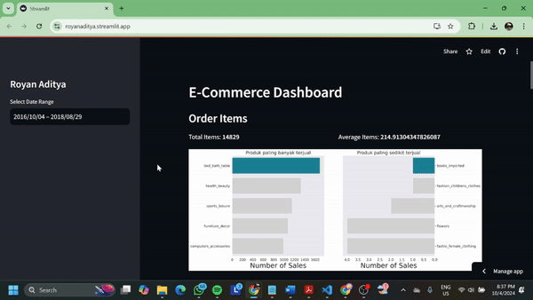

# Submission Dicoding "Belajar Data Analytics dengan Python"

## Project Data Analytics

## Deskripsi

Proyek ini bertujuan untuk menganalisis data pada E-Commerce Public Dataset. Tujuan akhirnya adalah untuk menghasilkan wawasan dan informasi yang berguna dari data yang dianalisis.

## Struktur Direktori

- **/data**: Direktori ini berisi data yang digunakan dalam proyek, dalam format .csv .
- **/dashboard**: Direktori ini berisi main.py yang digunakan untuk membuat dashboard hasil analisis data.
- **Proyek_Dicoding.ipynb**: File ini yang digunakan untuk melakukan analisis data.

## Instalasi

1. Clone repository ini ke komputer lokal Anda menggunakan perintah berikut:

   ```shell
   git clone https://github.com/royanaditya/AnalisisData.git
   ```

2. Pastikan Anda memiliki lingkungan Python yang sesuai dan pustaka-pustaka yang diperlukan. Anda dapat menginstal pustaka-pustaka tersebut dengan menjalankan perintah berikut:

   ```shell
   pip install streamlit
   pip install -r requirements.txt
   ```

## Setup Environment - Anaconda
```
conda create --name main-ds python=3.9
conda activate main-ds
pip install -r requirements.txt
```

## Setup Environment - Shell/Terminal
```
mkdir proyek_analisis_data
cd proyek_analisis_data
pipenv install
pipenv shell
pip install -r requirements.txt
```

## Run steamlit app
```
streamlit run main.py
```
Atau bisa dengan kunjungi website ini [Project Data Analytics](https://royanaditya.streamlit.app/)

## Contoh Run

## Kontribusi

Anda dapat berkontribusi pada proyek ini dengan melakukan pull request. Pastikan untuk menjelaskan perubahan yang Anda usulkan secara jelas dan menyeluruh.
